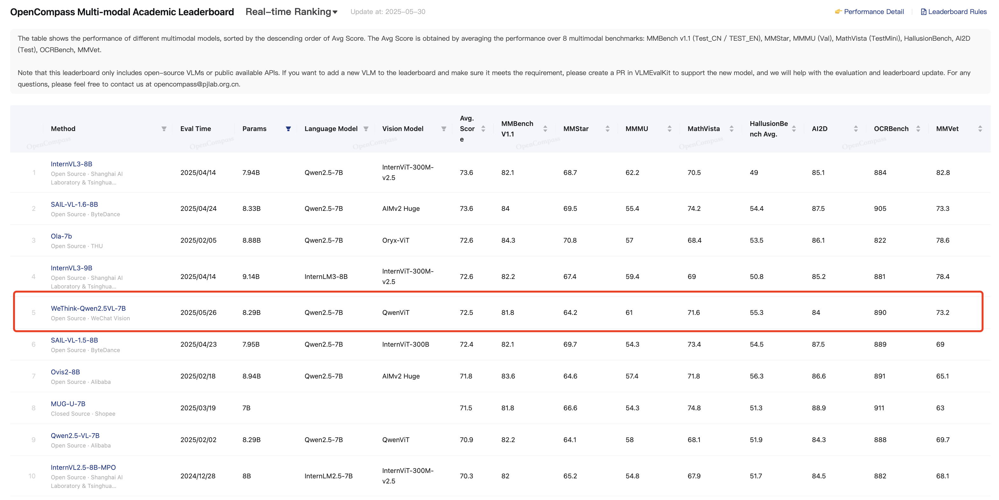

# WeThink: Toward General-purpose Vision-Language Reasoning via Reinforcement Learning


<p align="center">
  
  <a href="" target="_blank">Arxiv</a>  
  💻  <a href="https://github.com/yangjie-cv/WeThink" target="_blank">Code</a>  
    
  <a href="https://huggingface.co/datasets/yangjie-cv/WeThink_Multimodal_Reasoning_120K" target="_blank">WeThink Dataset</a>  
    
  <a href="https://huggingface.co/yangjie-cv/WeThink-Qwen2.5VL-7B" target="_blank">WeThink-Qwen2.5VL-7B Model</a>  

</p>


## 🏆 Performance Highlights
**WeThink-Qwen2.5VL-7B** achieves:
- 🥇 **1st place** on [OpenCompass Multimodal Reasoning Leaderboard](https://rank.opencompass.org.cn/leaderboard-multimodal-reasoning/?m=REALTIME)
- 🏅 **5th place** on [OpenCompass Multi-modal Academic Leaderboard](https://rank.opencompass.org.cn/leaderboard-multimodal/?m=REALTIME)  
*(As of May 30th, 2025)*


-----




We highlight significant improvements over Qwen2.5-VL-7B across tasks ranging from mathematical reasoning to general challenges.

## 🚀 Quick Start
### 🔥 Inference
```bash
python inference.py
```
💡 ​​Note​​: System prompt is required during inference. 

### 📊 Evaluation
We have integrated WeThink-Qwen2.5VL-7B into the [VLMEvalKit](https://github.com/open-compass/VLMEvalKit). Please follow its [Quickstart guide](https://github.com/open-compass/VLMEvalKit/blob/main/docs/en/Quickstart.md) to evaluate WeThink-Qwen2.5VL-7B on various benchmarks.


### 📥 Dataset Download
#### Question-Answer Pairs
Download from the Huggingface: https://huggingface.co/datasets/yangjie-cv/WeThink_Multimodal_Reasoning_120K. The dataset format is as follows:
```json
{
  "problem": "QUESTION",
  "answer": "ANSWER",
  "category": "QUESTION TYPE",
  "abilities": "QUESTION REQUIRED ABILITIES",
  "refined_cot": "THINK PROCESS",
  "image_path": "IMAGE PATH",
  "reward": "REWARD METHOD"
}
```
#### Companion Images
Download image.zip.part-{aa-ap} from the Huggingface: https://huggingface.co/datasets/Xkev/LLaVA-CoT-100k, and use the following command to merge them:
```bash
cat image.zip.part-* > image.zip
unzip image.zip
```

### 🛠️ Training
#### Supervised Fine-Tuning
We recommond [LLaMA-Factory](https://github.com/hiyouga/LLaMA-Factory) for supervised finetine.
You can prepare our data into SFT format, such as:
```json
{
"conversations": [
    {
        "from": "human", 
        "value": "problem"
    },
    {
        "from": "gpt", 
        "value": "cot"
    }
                ],
"images": [ image_path ],
"system": "system prompt"
}
```
#### Reinforcement Learning using GRPO
Our implementation is built on [EasyR1](https://github.com/hiyouga/EasyR1), which has already supported rule-based RL.

Our training framework with the combination of rule-based and model-based rewards will be released soon.


## Acknowledgement 
We thank the great previous works and code frameworks, such as [LLaMA-Factory](https://github.com/hiyouga/LLaMA-Factory), [EasyR1](https://github.com/hiyouga/EasyR1), [VLMEvalKit](https://github.com/open-compass/VLMEvalKit), [LLaVA-COT](https://github.com/PKU-YuanGroup/LLaVA-CoT), [verl](https://github.com/volcengine/verl), [vllm](https://github.com/vllm-project/vllm), and [VLAA-Thinking](https://github.com/UCSC-VLAA/VLAA-Thinking). Thanks for their well-organized codes!


## Cite Us 


